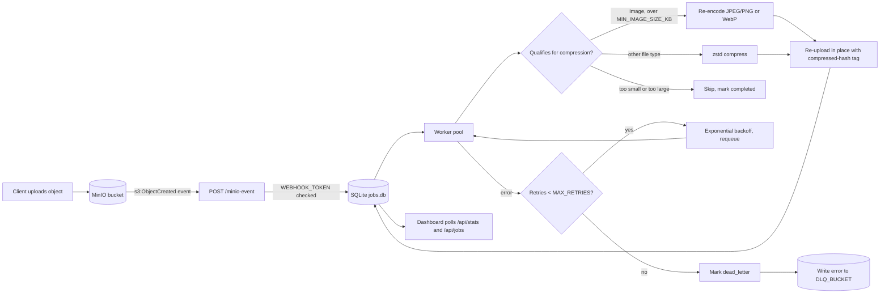

# file-compressor

A Go service that listens for MinIO bucket-notification webhooks and
transparently compresses newly-uploaded files in place: JPEG/PNG images are
re-encoded (optionally to WebP), and other file types are compressed with
zstd when enabled. Work is tracked in a persistent job queue with retries,
a dead-letter bucket for jobs that keep failing, and a live dashboard to
watch it all happen.

## How it works

1. MinIO is configured to POST an `s3:ObjectCreated:*` event to
   `/minio-event` whenever an object is uploaded to a watched bucket.
2. The handler persists one job per event to a local SQLite database
   (`DB_PATH`, `jobs.db` by default) and returns immediately — nothing
   blocks the webhook response.
3. A pool of worker goroutines (`WORKER_COUNT`) pulls queued jobs from the
   database, downloads the object, compresses it if it qualifies, and
   re-uploads it in place with a `compressed-hash` metadata tag so it's
   never re-compressed.
4. A job that errors is retried with exponential backoff (capped at 30s),
   up to `MAX_RETRIES` times. After that it's moved to `dead_letter` status
   and a copy of the error is written to `DLQ_BUCKET`.
5. Because job state lives in SQLite rather than only in memory, queued and
   in-flight jobs survive a restart — anything stuck in `processing` when
   the process starts is put back on the queue.

### Flow diagram



On restart, any job stuck in `processing` is put back on the queue before workers start pulling again.

## Dashboard

The service serves a small dashboard at `/` showing live counts of queued,
processing, completed, and dead-letter jobs, total bytes saved, and tables
of what's in flight, recently completed, and failed. It's a static page
(embedded in the binary, no build step) that polls `/api/stats` and
`/api/jobs` every 2 seconds.

### JSON API

| Endpoint | Description |
|---|---|
| `GET /api/stats` | Counts per status + total original/compressed bytes |
| `GET /api/jobs?status=&limit=` | Job list, optionally filtered by `queued`, `processing`, `completed`, or `dead_letter` (default limit 100, max 500) |
| `GET /healthz` | Liveness check |

## Configuration

All settings are read from environment variables (loaded from `.env` via
[godotenv](https://github.com/joho/godotenv) if present). Copy
`.env.example` to `.env` and fill in real values — `.env` is gitignored and
should never be committed.

| Variable | Default | Description |
|---|---|---|
| `MINIO_ENDPOINT` | — | MinIO server address, e.g. `localhost:9000` |
| `MINIO_ACCESS_KEY` | — | MinIO access key |
| `MINIO_SECRET_KEY` | — | MinIO secret key |
| `MINIO_USE_SSL` | — | `true`/`false` — must match how MinIO is actually served |
| `DASHBOARD_TOKEN` | — | Basic-auth password (any username) for the dashboard and `/api/*`. Required unless `ALLOW_INSECURE=true` |
| `ALLOW_INSECURE` | `false` | Allow starting with `WEBHOOK_TOKEN`/`DASHBOARD_TOKEN` unset (local dev only) |
| `WEBHOOK_TOKEN` | *(empty)* | Shared secret required on `/minio-event`, accepted as either the `X-Webhook-Token` header or `Authorization: Bearer <token>`. Required unless `ALLOW_INSECURE=true` |
| `ENABLE_WEBP` | `false` | Re-encode images to WebP instead of their original format |
| `MIN_IMAGE_SIZE_KB` | `100` | Skip files smaller than this — not worth compressing |
| `MAX_FILE_SIZE_MB` | `200` | Skip files larger than this (checked via stat before downloading). The whole file is loaded into memory, so this bounds worst-case memory use |
| `JOB_RETENTION_DAYS` | `90` | Delete finished job rows older than this (`0` keeps forever). Dashboard totals cover the retained rows |
| `IMAGE_QUALITY` | `75` | JPEG/WebP quality, 1–100 |
| `MAX_IMAGE_DIMENSION` | `0` | Downscale images whose longer side exceeds this many pixels (`0` = never). JPEG EXIF rotation is applied to the pixels, since re-encoding drops the EXIF block |
| `BUCKET_RULES` | *(empty)* | JSON per-bucket overrides of `image_quality`, `max_dimension` and `webp`, e.g. `{"photos":{"image_quality":60,"max_dimension":2048}}`. Unset fields use the globals; unknown fields or out-of-range values stop startup |
| `MAX_IMAGE_MEGAPIXELS` | `100` | Skip images that decode to more than this many megapixels (decompression-bomb guard); `0` disables |
| `OUTPUT_BUCKET` | *(empty)* | Non-destructive mode: write results to this bucket under the same key and leave the source untouched. Empty compresses in place. Must differ from `DLQ_BUCKET` and not be in `ALLOWED_BUCKETS`; created at startup if missing. Events from it are ignored |
| `ALLOWED_BUCKETS` | *(empty)* | Comma-separated bucket allowlist; empty means every bucket except `DLQ_BUCKET` |
| `JOB_TIMEOUT_SECONDS` | `300` | Per-job time limit for MinIO I/O and compression |
| `ENABLE_GENERIC_COMPRESSION` | `true` | Compress non-image files into a sibling `<key>.zst` object. The original is left untouched (zstd bytes aren't a valid file of the original type), so this does not reduce storage unless you delete originals yourself; `.zst` objects are never reprocessed |
| `GENERIC_COMPRESSION` | `zstd` | Algorithm for non-image files (only `zstd` currently) |
| `ZSTD_LEVEL` | `3` | zstd compression level (1–22) |
| `WORKER_COUNT` | `5` | Number of concurrent worker goroutines |
| `MAX_RETRIES` | `3` | Attempts before a job is dead-lettered |
| `DLQ_BUCKET` | — | Bucket that stores error details for dead-lettered jobs |
| `DB_PATH` | `jobs.db` | Path to the SQLite job-queue database |
| `LOG_DIR` | `logs` | Directory for day-wise log files (`logs/YYYY-MM-DD.log`) |
| `LOG_RETENTION_DAYS` | `30` | Log files older than this are deleted by the background cleanup scheduler |
| `LOG_LEVEL` | `info` | `debug`, `info`, `warn` or `error`. `debug` adds per-job steps and the reason each object was skipped. Switchable at runtime via `POST /api/loglevel?level=…` |
| `LOG_FORMAT` | `json` | Console encoding, `json` or `text`; log files are always JSON |
| `PORT` | `8090` | HTTP listen port |

## Logging

Every log line is written as JSON to both stdout and `logs/<YYYY-MM-DD>.log`
(via `log/slog`), rotating to a new file automatically at midnight. A
background scheduler runs once at startup and then once every 24h, deleting
any log file older than `LOG_RETENTION_DAYS` (default 30) so the `logs/`
directory doesn't grow unbounded. No external cron/task scheduler is
required — it's a goroutine inside the service itself.

## Running locally

```bash
cp .env.example .env
# edit .env with your MinIO credentials

go run -tags nodynamic ./cmd/server
# or: ./scripts/run.ps1  /  make run
```

Run the tests the same way: `make test` or `./scripts/test.ps1` (a bare `go test`
panics on 32-bit Windows Go because of the same `webp` issue).

Then open `http://localhost:8090` for the dashboard.

> **Why `-tags nodynamic`:** `gen2brain/webp` first tries to load a system
> `libwebp` shared library via `purego`, falling back to a bundled
> CGo-free WASM decoder/encoder only if that fails. On `windows/386` (some
> Windows Go installs default `GOARCH` to `386`), the purego dynamic-loading
> code path panics unconditionally at package `init()` — before it even
> checks whether the library exists — regardless of whether `ENABLE_WEBP` is
> used. The `nodynamic` build tag excludes that code path entirely, so the
> service always uses the portable WASM implementation. It's baked into
> `Makefile` and `scripts/*.ps1`; if you invoke `go build`/`go run` directly,
> include `-tags nodynamic` yourself.

## Configuring the MinIO webhook

```bash
mc admin config set myminio notify_webhook:compressor \
  endpoint="http://<service-host>:8090/minio-event" \
  auth_token="<value of WEBHOOK_TOKEN>"

mc admin service restart myminio

mc event add myminio/<bucket> arn:minio:sqs::compressor:webhook \
  --event put
```

MinIO sends `auth_token` as an `Authorization: Bearer <token>` header, which
`/minio-event` accepts directly — no reverse proxy needed. Set `auth_token`
to the same value as `WEBHOOK_TOKEN` and requests without a matching token
(in either `Authorization: Bearer` or `X-Webhook-Token` form) get a 401.

## Known limitations

- Files are fully buffered in memory for hashing and compression; `MAX_FILE_SIZE_MB`
  bounds this but very large files still cost real memory per in-flight job.
- The job database is a single SQLite file with writes serialized in-process —
  fine for one service instance, not designed for multiple replicas sharing
  one `DB_PATH`.
- The dashboard and JSON API have no authentication of their own; put them
  behind a reverse proxy or restrict network access if exposed beyond
  localhost.
- Compressed output keeps the original object key even when the content type
  changes (e.g. PNG → WebP with `ENABLE_WEBP=true`). Clients that trust the
  `Content-Type` MinIO serves are unaffected; clients that infer format from
  the file extension are not.

## Running with Docker

`docker compose up --build` starts MinIO and this service together, creates an
`uploads` bucket, a service-account key pair for the app, and the upload
webhook. Set `MINIO_ROOT_USER`, `MINIO_ROOT_PASSWORD`, `MINIO_ACCESS_KEY`,
`MINIO_SECRET_KEY`, `WEBHOOK_TOKEN` and `DASHBOARD_TOKEN` in `.env` first. The
job database and logs persist in the `app-data` volume.

`/healthz` is a liveness check; `/readyz` also verifies the database and MinIO.

## Dashboard actions

All of these sit behind `DASHBOARD_TOKEN`, and the POSTs additionally require an
`X-Requested-With` header (the dashboard sends it; with curl add
`-H 'X-Requested-With: curl'`).

- **Retry** a dead-letter job: `POST /api/jobs/{id}/retry` (button on each row).
  Resets its retry budget and requeues it.
- **Backfill** objects that predate the webhook: `POST /api/backfill?bucket=<b>&prefix=<p>`,
  `GET /api/backfill` for progress. One backfill runs at a time (409 otherwise).
  It skips `.zst` keys and objects outside the size limits; objects already
  compressed in place are queued but finish quickly as no-ops.
